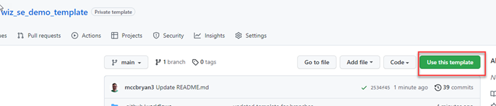
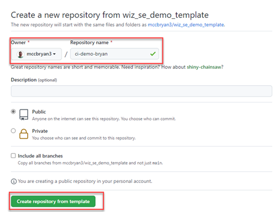
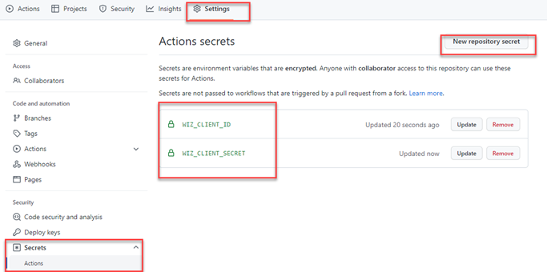
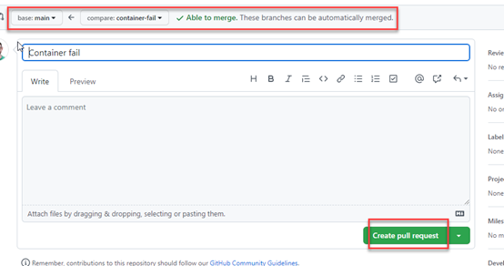
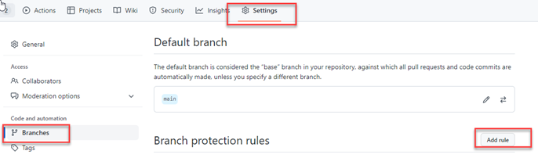
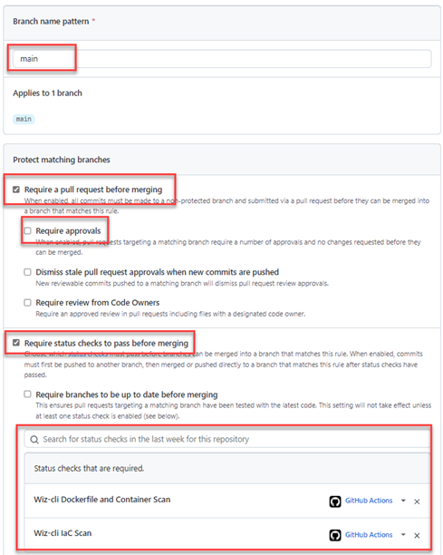
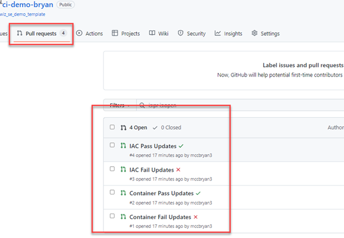

# Wiz SE Demo Repository - Github

### Description
This repository is dedicated to providing a starting point for SE demos using CI integration for WizCLI

## Requirements

* Github Account
* Wiz Service Account (`create:security_scans`)
* Ability to work with branches in Git

### OPTIONAL - Supporting requirements for dev machine

* Git installed
* VS Code
* Wiz-CLI
* AWSCLI installed and operational
* Azure CLI installed and operational
* Terraform >= 1.0 installed and operational
* Docker installed and running

## Basic Setup

1. Create a new repository from the template repository

2. Set repository target and name (customize name to fit your needs)

NOTE: BE SURE TO SELECT YOUR PERSONAL REPO

3. Recreate repository secrets (obtained from Wiz service account `security_scan:create`)
  * WIZ_CLIENT_ID
  * WIZ_CLIENT_SECRET

NOTE: If targeting test you may also set the `WIZ_ENV` here as well.

4. Get coffee

☕️ Template cleanup process takes a few minutes

5. Check for branches

## Basic Usage

This repo is configured to have the following additonal branches

* container-pass
* container-fail
* iac-pass
* iac-fail

**(main branch not shown here)**

1. Each branch has a new text file in it with the same name referred to here as `branch-file.txt`.

2. Navigate to the Pull Requests tab root and you should see `Create pull request`

3. Select a branch and it should populate a PR template

4. Simply use all of the defaults and select `Create pull request`

5. Repeat for the other branches branches

The github actions located in `.github/workflows` will provide the required actions during PRs

6. Enable branch protection

7. Configure branch protection for `main`

**NOTE: BE SURE TO SELECT BOTH ACTIONS** `Wiz-cli Dockerfile and Container Scan` and `Wiz-cli IaC Scan`

8. Go back and view you PRs

----------------------
 
 

## Miscellaneous

This repository is currently under development. If you see a problem please open an issue.

### Container Scanning Inventory

<b>Inventory</b> 
| Folder | Item | Purpose|
--------|--------|------|
|`contianer-pass`|`Dockerfile`| Should be built in a way to pass all checks|
|`container-fail`|`Dockerfile`| Uses old version, copies in secrets, does not conform to standards|
|`container-fail`|`awssecret.txt`|Contains secret in text|
|`container-fail`|`secret.yaml`|Contains secret in text|

### IaC Scanning Inventory

<b>Inventory</b> 
| Folder | Purpose|
--------|--------|
|`aws/terraforn-eks-pass`| Terraform instructions to build an EKS cluster |
|`aws/terraforn-eks-fail`| Terraform instructions to build an EKS cluster |
|`azure/terraform-aks-pass`| FUTURE USE |
|`azure/terraform-aks-fail`| FUTURE USE |

